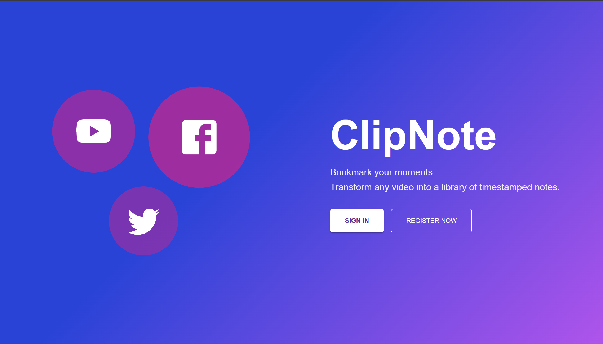
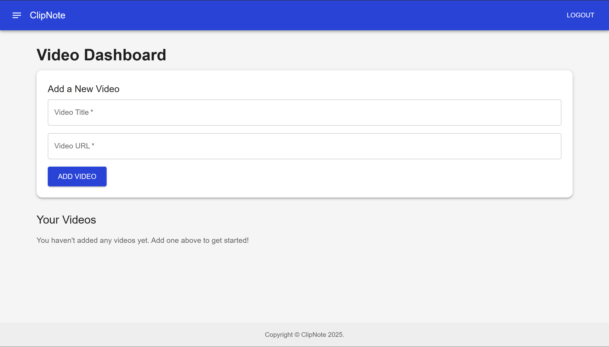
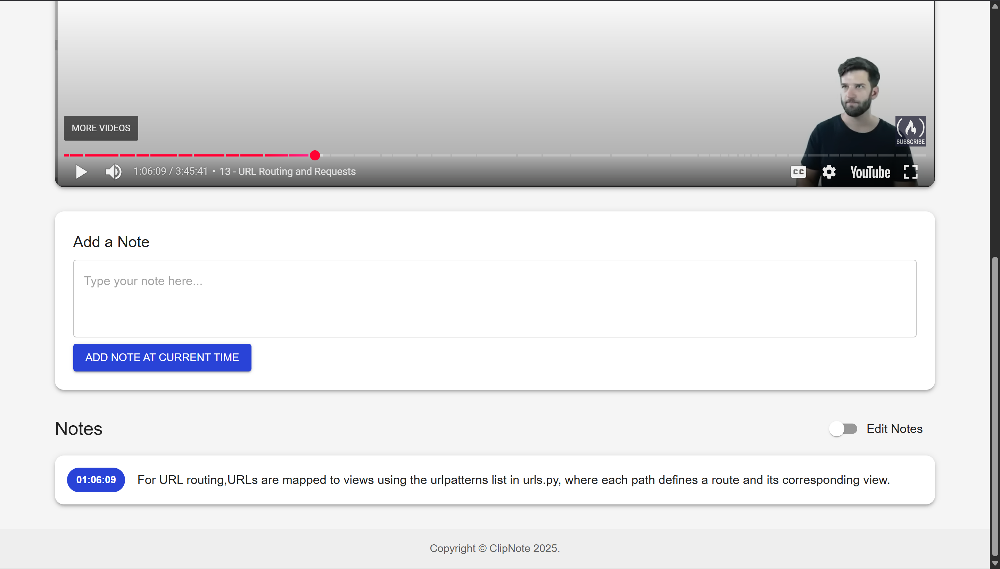

# ✒️ ClipNote – Your Personal Video Annotation Tool

ClipNote is a full-stack web application that transforms video watching into a powerful note-taking experience. Simply import any YouTube video and add timestamped notes that allow you to instantly jump back to important parts — perfect for learning, research, and content review.

---

## ✨ Features

- 🎥 **YouTube Video Import** – Add videos to your library with a simple URL.
- 🕒 **Timestamped Notes** – Add notes tied to specific moments in the video.
- 🧭 **Interactive Playback** – Click on a note to jump directly to that point.
- ✏️ **Full CRUD** – Manage your videos and notes effortlessly.
- 🔐 **Secure Authentication** – Protected with Django + JWT.
- 📱 **Responsive UI** – Works great on mobile and desktop with Material-UI.

---

## 🛠️ Tech Stack

| Layer        | Technology                                                                 |
|--------------|-----------------------------------------------------------------------------|
| Frontend     | React (Vite), React Router, Material-UI (MUI), Axios                       |
| Backend      | Django, Django REST Framework, Simple JWT                                 |
| Database     | PostgreSQL                                                                 |
| Tooling      | Git, VS Code, Postman                                                      |
| Deployment   | Vercel (Frontend), Render (Backend + Database)                            |

---

## 🚀 Getting Started

### 📦 Prerequisites

- Node.js and npm
- Python 3.10+
- PostgreSQL
- Git

---

## 📸 Screenshots

### 🔹 Landing Page

### 🔹 Dashboard View

### 🔹 Video Detail with Notes

